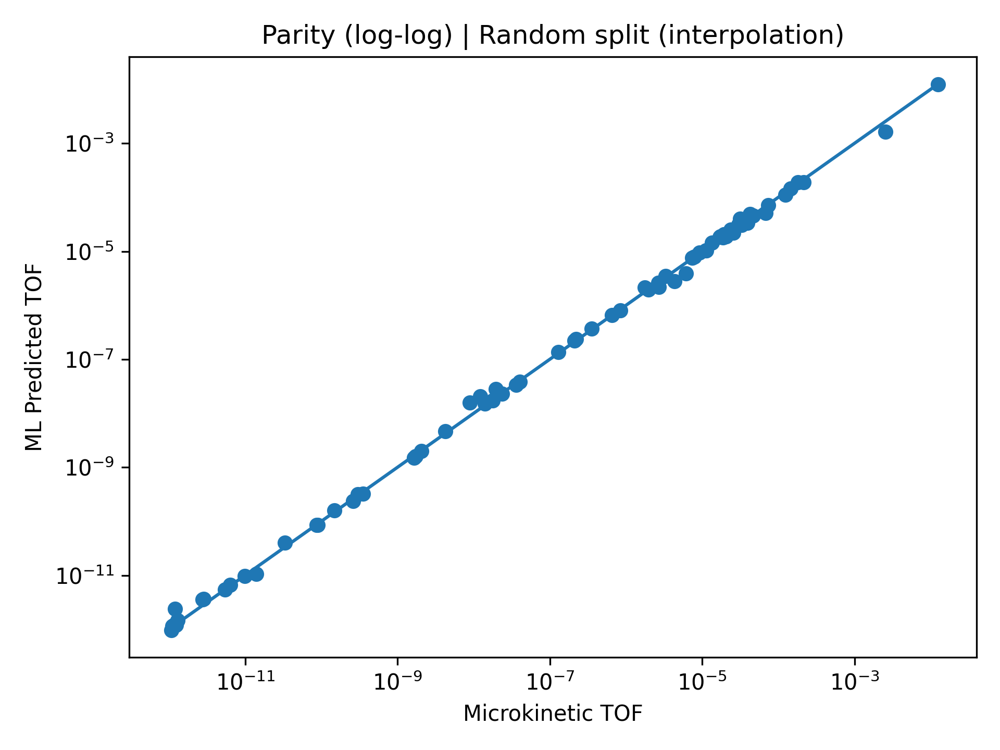
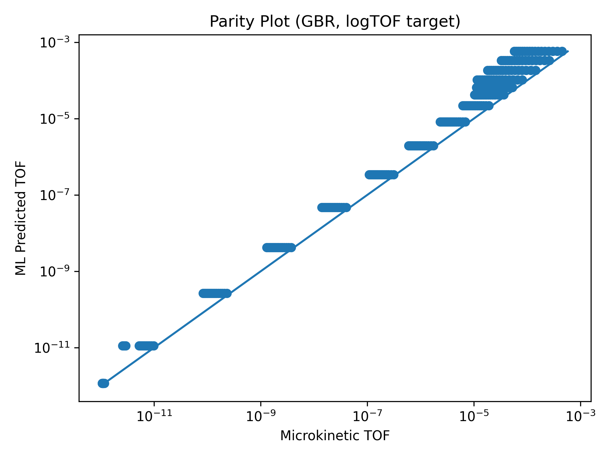
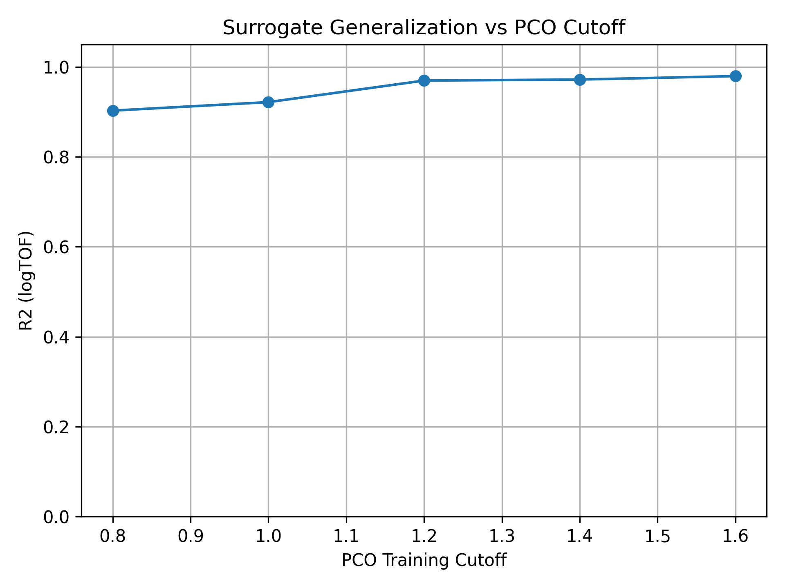
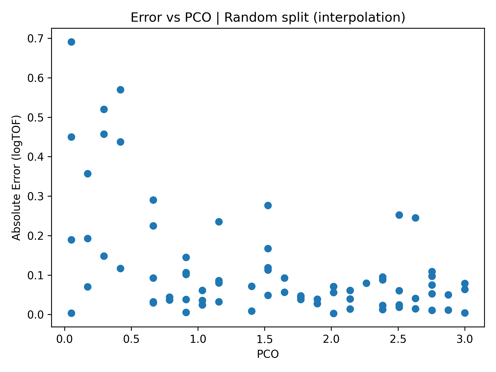

# ML Surrogate Model for Catalytic Microkinetics

Accelerating Catalytic Performance Prediction with Machine Learning

## Overview

Microkinetic models provide a powerful way to predict catalytic performance from reaction energetics. However, solving stiff kinetic ODE systems across large parameter spaces can become computationally expensive.

This repository develops a machine learning surrogate model that approximates microkinetic predictions and enables rapid evaluation of catalytic behavior.

The workflow transforms physics-based simulations into a data-driven predictor:

```bash
Microkinetic Simulation
        ↓
Dataset Generation
        ↓
ML Surrogate Training
        ↓
Fast Performance Prediction
```

The surrogate model learns the relationship between reaction conditions and catalytic turnover frequency (TOF), allowing rapid exploration of catalytic performance maps.

## Scientific Objective

The goal is to determine whether a machine learning model can approximate the behavior of a physics-based catalytic microkinetic model while preserving predictive accuracy.

Key questions include:

    • Can ML reproduce microkinetic TOF predictions?
    • How well does the surrogate generalize to unseen conditions?
    • How much computational speedup can be achieved?

## Dataset Generation

Training data is generated from the physics-based microkinetic model.

Inputs include:

    • Temperature
    • CO partial pressure
    • O₂ partial pressure

Outputs:

    • Steady-state turnover frequency (TOF)

The resulting dataset represents the catalytic response surface across reaction conditions.

## Machine Learning Model

A regression model is trained to predict catalytic performance directly from reaction conditions.

The surrogate model learns:

```bash
(T, P_CO, P_O2) → TOF
```
## Model Evaluation

Model performance is evaluated using parity plots and generalization tests.

### Prediction Accuracy



The parity plot compares ML predictions with microkinetic simulation results.

### Log-scale Prediction Performance



Log scaling highlights predictive accuracy across several orders of magnitude in TOF.

### Generalization Test



The surrogate model is evaluated on unseen regions of parameter space to assess extrapolation behavior.

### Error Distribution



Error analysis reveals how predictive accuracy varies with reaction conditions.

## Key Insight

Physics-based catalytic models provide mechanistic insight but are computationally expensive when exploring large parameter spaces.

Machine learning surrogates enable:

    • rapid evaluation of catalytic performance
    • efficient screening across operating conditions
    • integration with catalyst discovery workflows

The surrogate preserves the structure of the microkinetic model while dramatically reducing evaluation time.

## Repository Structure

ml/
    generate_dataset.py
    train_surrogate.py
    generalization_curve.py

ml/figures/
    parity_random.png
    parity_loglog.png
    generalization_curve.png
    error_vs_pco_random.png

## Reproducibility

Generate training data:

```bash
python ml/generate_dataset.py
```

Train surrogate model:
```bash
python ml/train_surrogate.py
```

Evaluate generalization:
```bash
python ml/generalization_curve.py
```

## Connection to the Catalysis Modeling Pipeline

This repository is part of a broader computational catalysis workflow:

```bash
Periodic DFT Surface Modeling
        ↓
Microkinetic Modeling
        ↓
ML Surrogate Acceleration
```

## Related repositories:

    • cat-adsorption-dft
    • co-microkinetics

